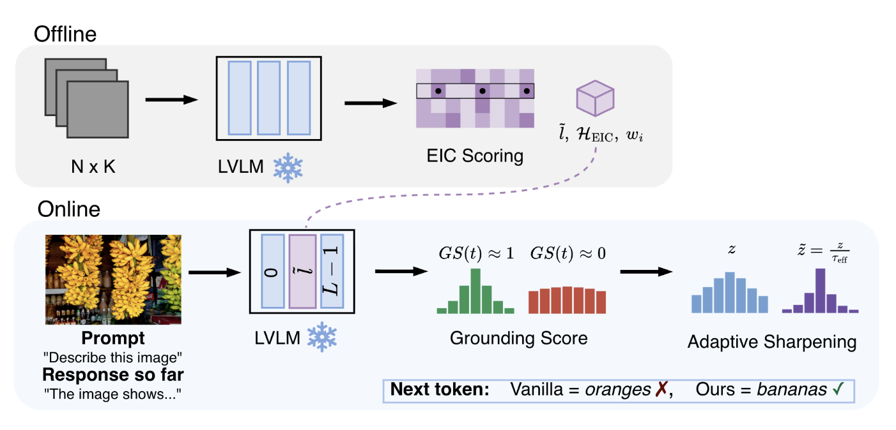
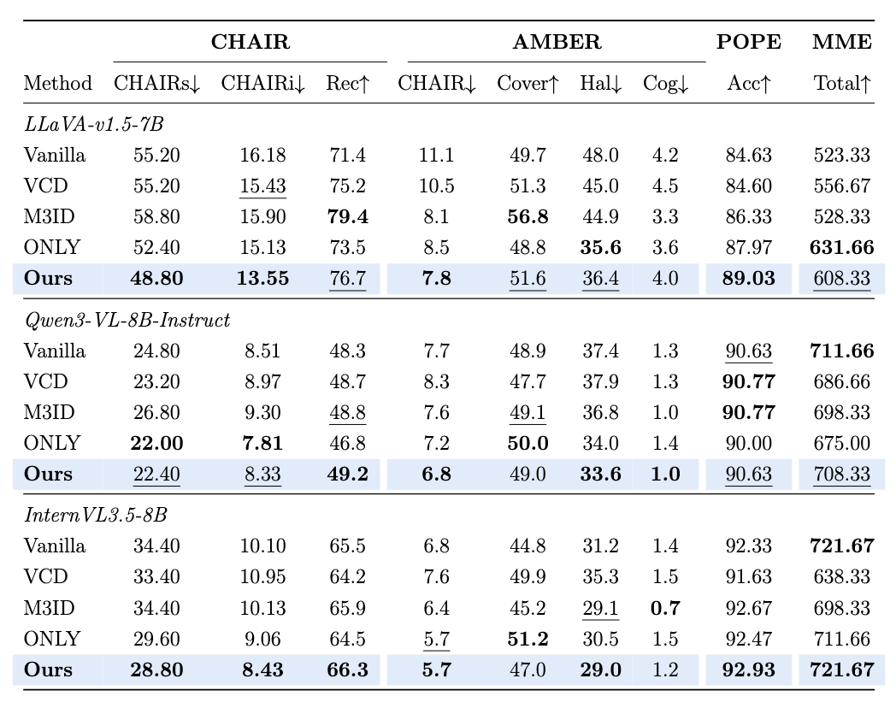
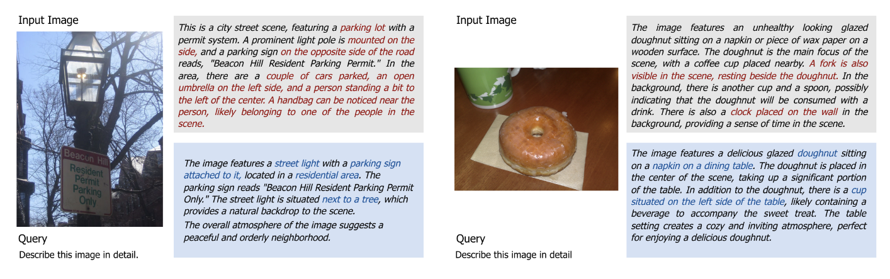

# Causal Decode-Time Steering for Hallucination Mitigation in Vision-Language Models

##### Alisia Sara Baielli

###### MSc Thesis · University of Amsterdam · 2026

# Main Process




**Figure 1: Method overview.** Offline EIC calibration identifies environment-stable grounding heads; at inference, a grounding score modulates logit sharpening.


**Offline (once per model):** build K=7 pseudo-environments, compute per-head TVER, filter text-heavy heads, derive EIC scores, and select the intervention layer. Saved to `scores/*_eic.pt`.

**Online (single pass):** hook high-EIC heads at the chosen layer, compute a grounding score GS(t) over image tokens, and sharpen logits when grounding drops (`τ_eff = max(1 − α(1 − GS), τ_floor)`).

## Visualizations




**Main results across CHAIR, AMBER, POPE, and MME (LLaVA, Qwen3-VL, InternVL).**




**Qualitative comparison: vanilla vs. Ours.**


## Environment 

```bash
bash scripts/setup_env.sh          # creates/updates conda env 'chall'
conda activate chall
```

`scripts/setup_env.sh` installs `requirements.txt` and sets `PYTHONPATH` / `PYTHONSTARTUP` for the patched Qwen3/InternVL model code.

Place model weights under `data/models/`, benchmarks under `data/` (COCO, POPE, AMBER, MME). All run scripts source `scripts/_env.sh` for paths and the active conda env.

## Calibration

Run once per model:

```bash
sbatch scripts/calibrate/llava.sh
sbatch scripts/calibrate/qwen3.sh
sbatch scripts/calibrate/internvl.sh
```

## Evaluation

Main table: **3 models × 4 benchmarks × 5 methods** (Vanilla, VCD, M3ID, ONLY, Ours). 

```bash
sbatch scripts/eval/llava_chair.sh
sbatch scripts/eval/llava_pope.sh
sbatch scripts/eval/llava_amber.sh
sbatch scripts/eval/llava_mme.sh
# qwen3_* / internvl_* under scripts/eval/

sbatch scripts/reproduce/llava_chair_all.sh
# Resume a partial run (skip methods that already have chair_results.json):
# SKIP_EXISTING=1 sbatch scripts/reproduce/llava_chair_all.sh
```

**Reproduction.** `scripts/reproduce/run.sh <model> <benchmark>` runs all methods and prints a summary table; `scripts/reproduce/submit_all.sh` submits the entire grid (hallucination + capability + caption-quality) as SLURM jobs:

```bash
bash scripts/reproduce/run.sh llava chair     # or pope / amber / mme / mmvp / mmbench
bash scripts/reproduce/submit_all.sh          # full thesis grid
```

Default settings (seeds, sample counts, POPE split) live in `scripts/reproduce/run.sh`; `run.sh` prints a summary table after each run.